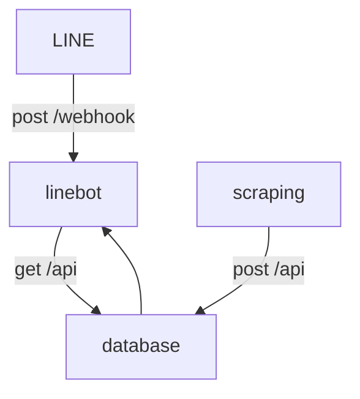

# menu-bot
<p align="center">
  <picture>
  <source media="(prefers-color-scheme: dark)" srcset="readme-material/icon_w_trans.png" width="300" >
  
    </picture>
</p>

## about menu-bot

TODO: いつか説明を書く

### アーキテクチャ



## プロジェクトの始め方

### 実行環境

- node: v18.16.1

### 開発を開始するコマンド

```
git clone git@github.com:aizuhack2023-team06/menu-bot.git
cd menu-bot
npm install
code .
```

### VSCodeに入れる拡張機能

- Rome LSP VS Code Extension

### ローカルで動かす

1. .envファイルを書く
1. ngrokを実行
1. npm start

```
npx ngrok http 3000
npm start
```

## gitの運用

### branchの作成

- GitHub Flow的な
- 適当な名前のbranchを作って作業する

### Pull request

- 作業を始めたら、できるだけ早くDraft Pull requestを作る
- 自由にコメントを書く
